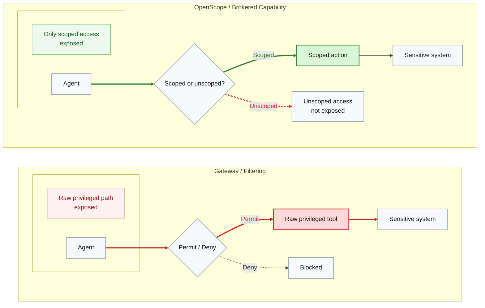
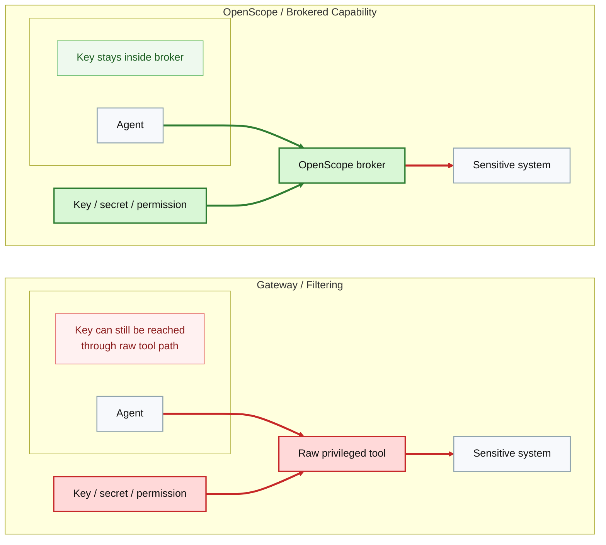
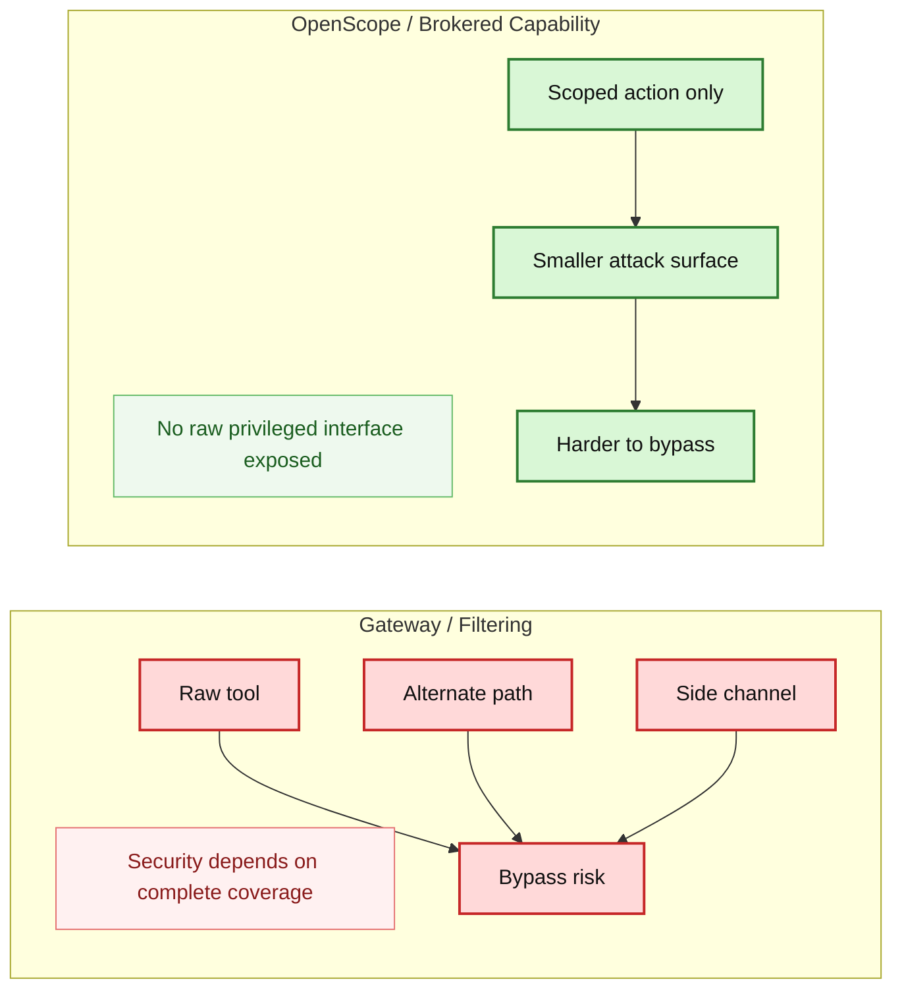
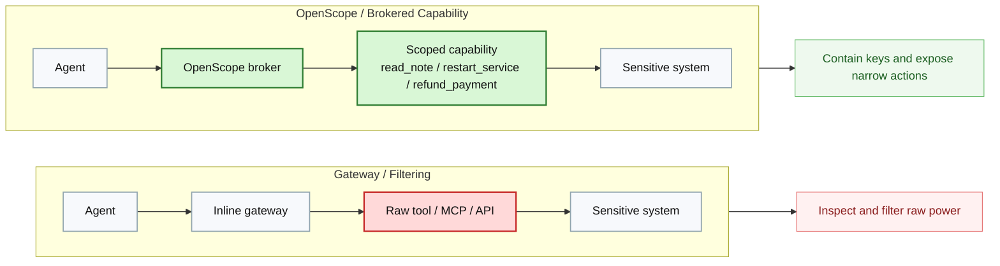

# Apture vs OpenScope Security Positioning

## Slide 1: Filter Raw Privilege vs Expose Only Scoped Access

Caption: A gateway decides whether an agent may use a raw privileged tool. OpenScope never exposes that raw tool at all.

## Slide 2: Where The Key Lives

Caption: Filtering can govern requests, but the raw credentialed path still exists. OpenScope keeps the key inside the broker.

## Slide 3: Why Bypass Happens

Caption: Gateways must keep every path in-band. OpenScope reduces bypass risk by removing the raw privileged primitive.

## Slide 4: Architecture Difference

Caption: Gateways govern access to raw tools. OpenScope transforms privileged systems into narrow, auditable capabilities.
