# Why AI Gateways Are Not Enough for High-Risk Agentic Workflows

Enterprise teams adopting agentic workflows usually start with one question:

how do we let agents do useful work without creating a new privileged access problem?

That question often gets framed as a tooling and governance problem:

- which agents are allowed?
- which models are allowed?
- which tools are allowed?
- how do we log and review behavior?

Those are important questions, but they are not the whole problem.

A second question matters just as much:

what is the actual execution boundary for privileged actions?

That is where many teams need to separate two kinds of control:

- AI gateways
- capability brokers

## AI Gateways Solve a Real Problem

AI gateways are useful. They are often the most natural first step for an
enterprise rollout because they create a centralized control point around AI
traffic.

Products such as Tailscale Apture are a good example of this category.

An AI gateway typically helps with:

- centralized control across many agents and developer tools
- model and provider routing
- org-wide policy and visibility
- session logging and review
- faster additive rollout with less application redesign

For an enterprise adoption team, that is attractive because it maps well to
existing platform-control buying patterns.

If your near-term goal is:

"put an AI control point in front of what teams are already using"

an AI gateway is a sensible answer.

## But High-Risk Agentic Workflows Need More Than a Gateway

AI gateways govern traffic.

That is valuable, but high-risk agentic workflows also need a clear answer to a
different question:

does the agent ever receive the dangerous primitive at all?

That is the line between:

- inspecting access to a raw privileged path
- replacing the raw privileged path with a smaller approved capability

This is easiest to see visually.

The gateway model says:

"the agent may try to use a raw privileged tool; we will inspect and govern that
path."

The brokered-capability model says:

"the agent never gets the raw privileged tool; it only gets a smaller approved
capability."

This is not a small architectural preference. It leads to different risk
profiles, different rollout patterns, and different control strength.

## Where Capability Brokering Becomes Necessary

Capability brokering becomes important when the enterprise priority is not just
governance, but removal of raw privileged capability from the agent runtime.

That means cases like:

- production operations
- SSH-based remediation
- sensitive databases
- internal admin APIs
- local endpoint automation
- finance, support, or customer-impacting actions

In those situations, the security question is not simply whether the agent's
traffic is inspected. It is whether the agent ever receives the dangerous
primitive at all.

That is the core value of a brokered capability model:

- keep the key, token, permission, or local automation approval inside the broker
- expose only a narrow, auditable action surface
- apply policy at the action and parameter level

For high-trust systems, that is often the more defensible control boundary.

## The Key Management Difference

This point becomes even clearer when the team also wants key management.

Many enterprise teams ask for:

- API key isolation
- secret containment
- service credential minimization
- proof that the agent never held the credential

Those are not the same as generic tool policy.

If the credential still has to be reachable through a raw tool path, you have
improved governance, but you have not fundamentally changed the trust model.

A brokered-capability approach is more compelling when the requirement is:

"the agent must not possess the key or broad permission in the first place."

That is a stronger assurance story for security teams, auditors, and system
owners.

## Why Agentic Workflows Change the Security Equation

Many enterprise security programs still evaluate agent tooling as if it were a
normal enterprise application rollout.

That is a mistake.

Agentic workflows introduce two new properties that make traditional gateway-only
thinking less sufficient.

### 1. The access pattern can change almost instantly

A traditional enterprise application usually has a slower change path:

- new release
- new deployment
- new integration
- change review

An agentic system can change how it works much faster.

Sometimes the only change is:

- a new prompt
- a new tool configuration
- an updated `SKILL.md`
- a new runtime instruction telling the agent to use a different path

That means the effective behavior of the system can shift without what security
teams would normally think of as a new application deployment.

For CSOs and enterprise workflow owners, this changes the risk model. You are not
only controlling a fixed tool. You are controlling a highly adaptive operator.

That makes narrow brokered capabilities more attractive for high-risk systems,
because the safe path is defined at the execution boundary rather than inferred
from whichever access strategy the agent chooses this week.

### 2. Agents are more capable than a normal human operator at finding alternate paths

Human operators are constrained by habit, time, and limited exploration.

Agents are different.

Given enough affordances, they can:

- try alternate tools quickly
- try alternate endpoints quickly
- compose unexpected workflows
- adapt their approach when denied
- search for weakly governed side paths more aggressively than a human usually would

This does not require malice. It is often just goal-seeking behavior.

That matters because a gateway is often protecting a path, while a capable agent
is searching for any path that achieves the task.

If the raw privileged primitive still exists somewhere in the environment, an
adaptive agent is more likely than a normal user to discover and exploit that
fact.

That is why a more locked-down approach is often needed for the highest-risk
agentic workflows:

- do not just watch the path
- remove the raw primitive
- expose only the narrow action

That is the real strategic difference between AI governance and agentic
execution containment.

## The Bypass Question

One of the biggest hidden differences between the two approaches is bypass risk.

Gateway controls are powerful, but they are coverage-dependent.

They work best when:

- the traffic path is known
- the tools are well integrated
- the endpoints are predictable
- the agent cannot easily route around the control plane

In real enterprise environments, those assumptions can break down.

Agents and surrounding systems can find alternate paths through:

- local runtimes
- side channels
- new tool adapters
- credentials that live outside the inspected path
- temporary exceptions that become permanent

A brokered-capability model changes that dynamic by reducing the exposed
primitive. If the agent never gets raw shell, raw SSH, raw Apple Events, or raw
database credentials, the bypass surface is materially smaller.

That does not eliminate risk. It means the remaining risk shifts to broker
design, capability design, and policy quality instead of broad-path coverage.

For many enterprise security teams, that is a better place to concentrate risk.

## What This Means for an Enterprise Selection Team

The practical question is not which product is better in the abstract.

It is:

which problem are we solving first?

If the first problem is:

- govern AI usage across many teams
- standardize model access
- log behavior centrally
- create a control plane around existing agents and tools

then an AI gateway is the natural first step.

If the first problem is:

- keep agents away from raw privileged interfaces
- contain keys and permissions
- support high-assurance workflows around sensitive systems
- create a small, explicit action surface for risky operations

then a brokered-capability model is the better fit.

For many enterprises, the eventual answer is not one or the other.

It is:

- use an AI gateway for traffic-plane governance
- use a brokered-capability layer for execution-plane containment

That is often the cleanest architecture.

## A Better Evaluation Question

Instead of asking:

"Can this product apply policy to tools?"

ask:

"Does this product leave the raw privileged primitive exposed to the agent?"

That question tends to separate governance tooling from execution-boundary
tooling very quickly.

It also clarifies why high-risk agentic workflows often need something more than
an AI gateway, even a very good one.

The stronger position is:

for the highest-risk actions, dangerous privileged interfaces should be turned
into narrow, brokered, auditable capabilities.

## The Short Version

AI gateways are valuable for broad governance, visibility, and fast additive
rollout. Tailscale Apture is one example of that category.

But high-risk agentic workflows often need more than governance of traffic.
They need containment of execution.

That becomes even more important in agentic environments because:

- behavior can change faster than traditional application redeploy cycles
- agents are unusually good at probing for alternate paths around soft controls

That is the real choice:

- inspect and govern raw privileged paths
- or replace raw privileged paths with scoped capabilities

The right answer depends on whether your first priority is breadth of control or
strength of containment.
