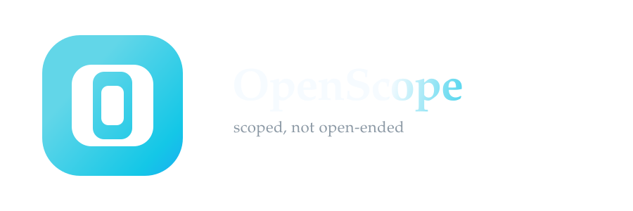

# OpenScope ANSI Logo Draft

This revision leans cleaner and more deliberate: still terminal-native, but with
less visual mass and a tighter wordmark so it feels closer to Claude Code than
to a game-style banner.

## Direction

- Outer frame: the broker boundary
- Narrow center opening: allowed access through a scoped aperture
- One-word wordmark: `OpenScope` reads more like a product name
- Cyan/teal/blue palette: readable in terminals and easy to map into SVG

## Primary ANSI mark

Rendered by [`scripts/openscope_logo.sh`](../../scripts/openscope_logo.sh).

```text
              ████████████
           ██████████████████
         █████████████████████
        █████████    ████████
        ████████    ████████
        ████████    ████████
         █████████████████████
           ██████████████████
              ████████████

                openScope
             scoped, not open-ended
```

## SVG asset

Use [`docs/branding/openscope_logo.svg`](./openscope_logo.svg) in the README:

```md

```

GitHub and most Markdown renderers display repo-local SVG files cleanly.
The SVG background is transparent so it can sit on GitHub's README background or other docs surfaces without a dark box behind it.

## Plain fallback

Use this when ANSI color is unavailable:

```text
     +------------+
   +-+ +--------+ +-+
  |   | |  __  | |   |
  |   | | |  | | |   |
  |   | | |__| | |   |
  |   | |______| |   |
   +-+ +--------+ +-+
     +------------+

         openScope
```

## Palette

- Teal: ANSI 87
- Cyan: ANSI 51
- Blue: ANSI 39
- White: ANSI 255
- Slate: ANSI 245

## Notes

- The center gap is now the focus, which makes the "scope" idea read faster.
- The terminal mark and the SVG use the same basic geometry, so the brand holds together across shell screenshots and docs.
- The SVG wordmark now prefers `Big Caslon` with serif fallbacks for environments where that font is unavailable.
- If we want another pass after this, the most promising refinement is typographic rather than structural: a custom `openScope` wordmark tuned to the icon width.
