# OpenScope v1

Markdown transcription of `docs/diagrams/openscope.pdf` and `docs/diagrams/openscope.key`, normalized for website and landing-page reuse.

## OpenScope

OpenScope is an AI agent capability broker that turns raw privileged access into scoped, auditable actions.

- Contain keys
- Remove raw powers
- Expose only approved actions

## Agentic Workflow Security Risks

- Agents can change behavior without a normal redeploy.
- A prompt, config change, or `SKILL.md` update can change access patterns fast.
- Agents are more persistent than human operators at finding alternate paths.
- Traditional tool-access controls are weaker when the actor is adaptive.

## Why AI Gateways Are Not Enough

- AI gateways are useful for governance, visibility, and routing.
- They mainly govern traffic paths.
- High-risk agent workflows need stronger execution containment.
- If the raw privileged primitive still exists, agents can search for ways around the governed path.

## Solution

Use OpenScope as a brokered-capability layer for agent containment.

- OpenScope keeps the sensitive system behind a broker.
- Agents receive scoped capabilities such as `read_note`, `restart_service`, or `refund_payment`.
- The broker contains keys and exposes only narrow actions.
- Gateways still help with filtering, but brokered capabilities matter when execution must stay tightly bounded.

## OpenScope Is a Capability Broker, Not Just a Gateway

- Keys, permissions, and privileged interfaces stay inside the broker.
- Agents call predefined scoped actions instead of raw tools.
- Policy is enforced at the action and parameter level.
- Result: smaller attack surface, no raw privileged interface, and fewer bypass options.

## The Core Security Difference

- A gateway inspects a raw privileged path.
- A brokered-capability model removes that raw path from the agent.
- Only scoped access is exposed.
- Unscoped privileged access is not exposed to the agent at all.

## The Key Management Difference

- For high-risk systems, the stronger requirement is that the agent never possesses the key or broad permission.
- In the OpenScope model, the key stays inside the broker.
- In a gateway-only model, the key can still be reached through the raw tool path.

## When Capability Brokering Becomes Necessary

Best fit when the system owner does not want the agent to ever hold the raw primitive.

- Production operations
- SSH-based remediation
- Sensitive databases
- Internal admin APIs
- Endpoint automation
- Finance, support, or customer-impacting actions

## How OpenScope Compares

| Product | Best At | Limitation vs OpenScope |
| --- | --- | --- |
| Tailscale Apture | AI gateway, routing, logging, centralized policy | Governs traffic, but does not remove raw privileged paths |
| BlueRock | Runtime security, sandboxing, guardrails | Strong runtime control, less focused on predefined scoped capabilities |
| MintMCP | MCP gateway, role-based tool exposure | Curates MCP access, but is still closer to gateway infrastructure |
| Peta / Agent Vault | Secret containment | Keeps keys away from agents, but does not fully define scoped action surfaces |
| OpenScope | Privileged capability brokering | Best fit when agents should never hold the raw primitive |

OpenScope is differentiated by replacing raw privileged tools with scoped, policy-bound actions.

## Conclusion

Don't just watch privileged paths. Replace them with scoped capabilities.

- Agentic workflows need more than AI governance.
- They need containment of privileged execution.
- OpenScope removes raw privileged access from the agent path.
- Use gateways for broad governance.
- Use OpenScope where bypass resistance and key containment matter.

Final decision question:

Do you leave the raw privileged primitive exposed to the agent?
