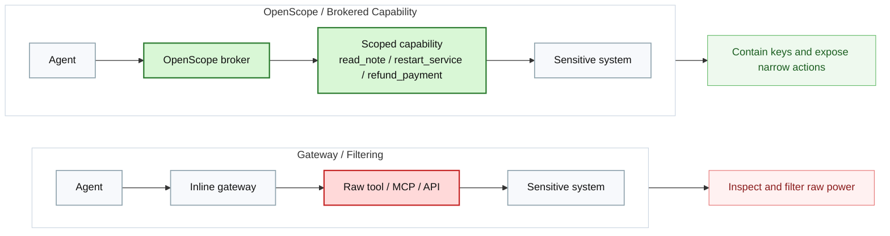
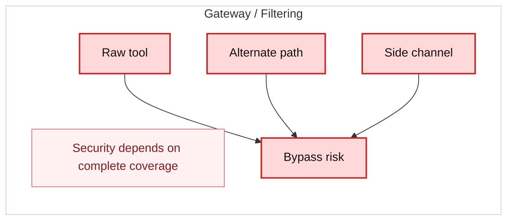
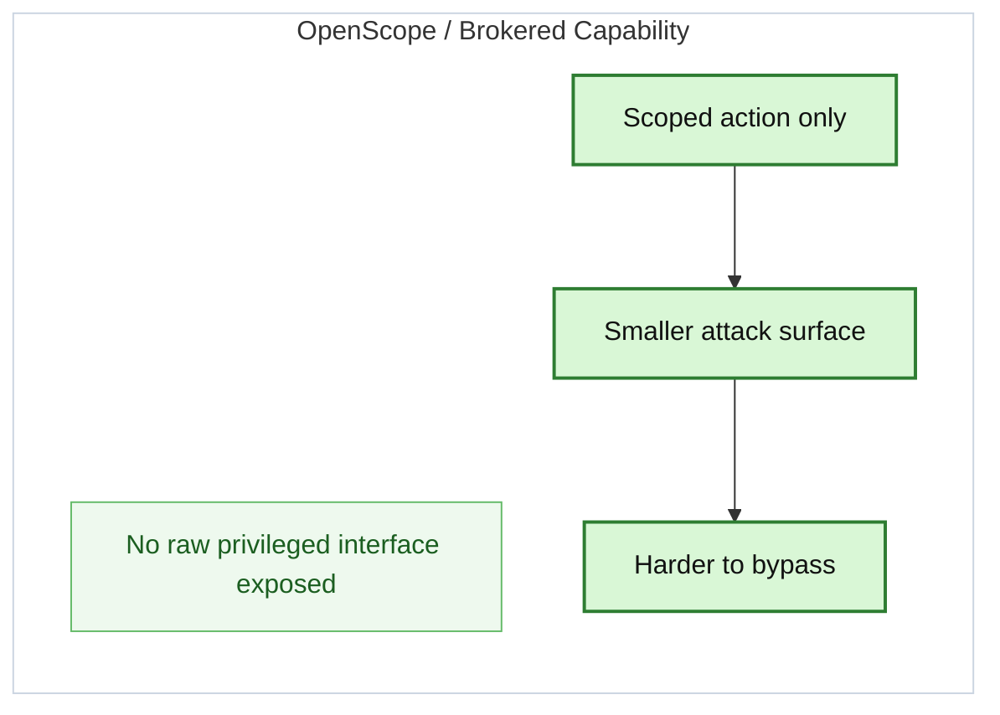
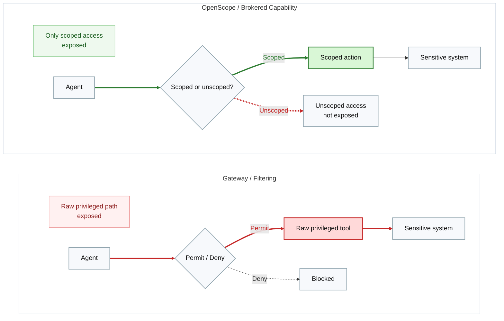
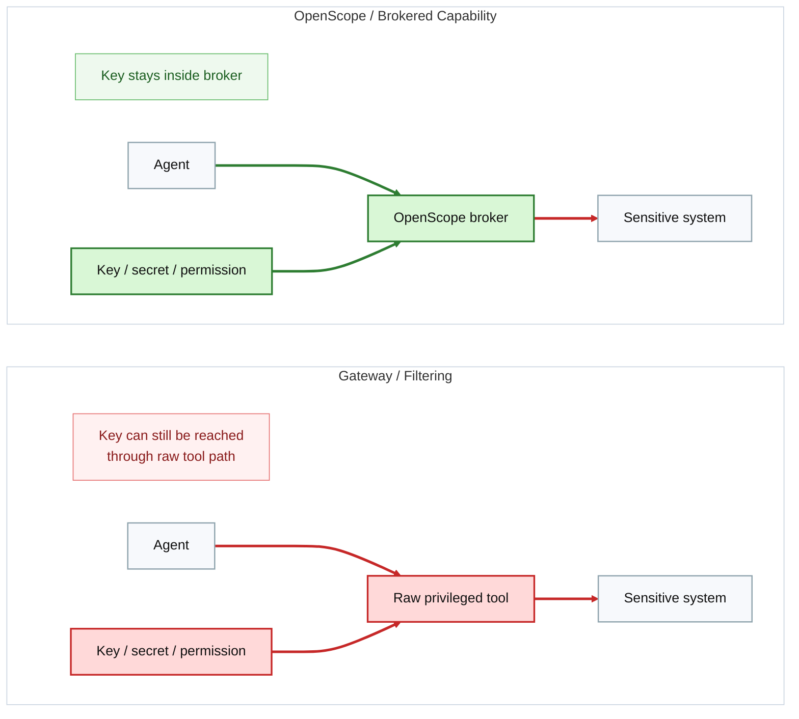

# open-scope.org Website Design Spec

This document is the source prompt/spec for generating the `open-scope.org` marketing site in code. The output should feel like a polished product landing page for a security infrastructure startup, not a generic SaaS template.

## Goal

Design a modern marketing website for OpenScope that explains its positioning clearly:

- OpenScope is an AI agent capability broker.
- It removes raw privileged access from the agent path.
- It is not just an AI gateway and not just a secret vault.
- It is the layer for scoped, auditable, policy-bound actions.

The site should make three things immediately obvious:

1. What OpenScope is.
2. Why it matters for high-risk agent workflows.
3. Where to get the code and how to download it.

## Primary Audience

- Security-conscious AI builders
- Infra and platform engineers
- Enterprise buyers evaluating agent containment
- Developers who want to inspect the repo and try the product

## Product Positioning

OpenScope should be positioned as:

- A capability broker for AI agents
- A containment layer for privileged execution
- A way to keep keys, permissions, and raw interfaces out of the agent
- A complement to AI gateways, not a replacement for all governance tooling

OpenScope should not be framed as:

- A generic chatbot product
- A consumer AI tool
- Just another MCP directory or tool registry
- A vague “AI security platform” without a concrete model

## Brand Direction

The visual style should feel:

- Technical
- Precise
- Calm
- Premium
- Security-forward

Avoid:

- Purple-heavy default AI gradients
- Cartoonish illustrations
- Overly playful startup aesthetics
- Generic “floating cards on white background” with no point of view

## Visual Language

### Core Mood

Use a dark ink-and-teal security aesthetic with controlled contrast. The page should feel like a secure control plane with intentional typography and strong diagram-led storytelling.

### Color Palette

Use CSS variables and keep the palette coherent:

- `--bg`: `#07111A`
- `--bg-elevated`: `#0D1B27`
- `--panel`: `#102332`
- `--text`: `#EAF4FB`
- `--muted`: `#9FB4C3`
- `--line`: `#214052`
- `--teal`: `#5EE7D8`
- `--cyan`: `#33C7FF`
- `--blue`: `#4D7CFE`
- `--green`: `#7EE081`
- `--warning`: `#FFB86B`

Backgrounds should use subtle grid/noise/pattern overlays and restrained radial gradients, not flat fills.

### Typography

Use expressive but credible typography:

- Headings: `Fraunces`, `DM Serif Display`, or another high-contrast serif with authority
- Body/UI: `Manrope`, `Plus Jakarta Sans`, or `IBM Plex Sans`
- Code/snippets: `IBM Plex Mono` or `JetBrains Mono`

Headlines should feel editorial and sharp. Body copy should stay clean and readable.

### Motion

Use restrained motion:

- Staggered reveal on hero content
- Soft line-draw or fade-in for architecture diagrams
- Hover states on buttons/cards
- Sticky header with subtle background shift on scroll

No excessive parallax or decorative animation loops.

## Site Map

Single-page landing site with the following sections:

1. Header / nav
2. Hero
3. Trusted positioning strip
4. Problem section
5. Solution section
6. Core differences section
7. Use cases section
8. Comparison section
9. Developer section
10. CTA footer

## Required Links

Use these exact URLs:

- Repo link: [https://github.com/cylonix/openscope](https://github.com/cylonix/openscope)
- Download link: [https://github.com/cylonix/openscope/releases](https://github.com/cylonix/openscope/releases)

Use the download link in all primary “Download” buttons unless a more specific release asset URL is later provided.

## Header / Nav

Header should be sticky and compact.

Left side:

- OpenScope logo
- Wordmark: `OpenScope`

Right side nav:

- `Why OpenScope`
- `How It Works`
- `Use Cases`
- `Compare`
- `Docs`
- `GitHub`

Right side actions:

- Secondary button: `View Code`
- Primary button: `Download`

Behavior:

- `GitHub` and `View Code` both point to the repo
- `Download` points to the GitHub releases page
- On mobile, collapse nav into a clean drawer

### Second-Level Navigation Content

Each primary nav item should reveal meaningful second-level content on desktop hover/focus and become expandable accordion content on mobile.

#### Why OpenScope

Use a two-column dropdown or mega-menu with these items:

- `Why gateways are not enough`
  Summary: `High-risk agent workflows need more than traffic inspection.`
- `Execution containment`
  Summary: `Remove the raw privileged path instead of trying to filter every use of it.`
- `Key containment`
  Summary: `Keep keys, tokens, and broad permissions inside the broker.`
- `Bypass resistance`
  Summary: `Adaptive agents search for alternate paths; brokered capabilities shrink the search space.`

Suggested supporting sources:

- `docs/enterprise_agentic_security_deck.md`
- `docs/blog_openscope_for_enterprise_agentic_teams.md`
- `docs/diagrams/openscope.md`

#### How It Works

Use a two-column dropdown with one column for architecture and one for operational model.

Items:

- `Broker architecture`
  Summary: `Agent -> openscope CLI -> openscoped daemon -> executor -> sensitive system`
- `Scoped capabilities`
  Summary: `Agents call narrow actions, not raw tools.`
- `Policy and audit`
  Summary: `Allow and deny rules apply at action and parameter level, with append-only audit logging.`
- `Protected integrations`
  Summary: `Start with Notes and Mail, then extend with YAML-defined apps, HTTP profiles, and SSH targets.`
- `Packaging`
  Summary: `Signed macOS runtime for stable automation approval and safer local brokering.`

Suggested supporting sources:

- `README.md`
- `docs/jira_over_http.md`
- `macos/XcodeSetup.md`
- `docs/local_validation_runbook.md`

#### Use Cases

Use a dropdown grouped by audience or environment.

Groups:

- `Enterprise agent workflows`
  Items:
  - `Production operations`
  - `Internal admin APIs`
  - `Sensitive databases`
  - `Finance and support actions`
- `Local and personal workflows`
  Items:
  - `OpenClaw on macOS`
  - `Sandboxed NemoClaw`
  - `Protected Notes and Mail access`
- `Brokered extensions`
  Items:
  - `Jira over broker-owned HTTP profiles`
  - `Scoped SSH service operations`

Suggested supporting sources:

- `docs/blog_openscope_for_enterprise_agentic_teams.md`
- `docs/blog_openscope_for_openclaw_personal_users.md`
- `docs/jira_over_http.md`

#### Docs

Use a docs-oriented mega-menu with clear categories rather than a flat list.

Categories:

- `Get started`
  - `README`
  - `OpenClaw user guide`
  - `NemoClaw install`
- `Architecture`
  - `Enterprise security deck`
  - `OpenScope diagrams`
  - `Cylonix OpenScope architecture`
- `Guides`
  - `Jira over HTTP`
  - `Local validation runbook`
  - `Packaging`
  - `Pilot guide`

Suggested supporting sources:

- `README.md`
- `docs/openclaw_user_guide.md`
- `docs/nemoclaw_install.md`
- `docs/cylonix_openscope_architecture.md`
- `docs/packaging.md`
- `docs/pilot_guide.md`

## Hero Section

### Layout

Two-column layout on desktop, stacked on mobile.

Left column:

- Eyebrow: `Scoped, auditable agent access`
- Main headline: `Don’t give AI agents raw power. Give them scoped capabilities.`
- Supporting copy:
  `OpenScope is a capability broker that turns raw privileged access into narrow, policy-bound actions. Keep keys inside the broker. Remove raw interfaces from the agent path. Audit every decision.`
- Primary CTA: `Download OpenScope`
- Secondary CTA: `View the Code`
- Small inline meta row:
  - `Open source`
  - `GitHub-based install`
  - `Built for high-risk workflows`

Right column:

- A dramatic visual composition using the OpenScope logo plus one of the architecture/security diagrams
- Recommended base visual: `architecture_difference.svg`
- Layer in a dark panel, glows, and diagram callouts
- Also make the hero compatible with a live Mermaid render if supported by the generation tool

Recommended Mermaid source for hero/right panel:



### Hero Notes

The hero should immediately establish that this is infrastructure/security software, not a dashboard product.

## Trusted Positioning Strip

A narrow band under the hero with 3 to 4 concise proof points:

- `Open source capability broker`
- `Policy-bound actions`
- `Key containment by design`
- `Built for agent execution control`

This strip should be minimal, almost like an annotated tagline rail.

## Problem Section

Section headline:

`AI gateways help. But high-risk workflows need stronger containment.`

Supporting copy:

`Gateways improve routing, visibility, and governance. But when raw privileged tools still exist, adaptive agents can search for alternate paths. Security cannot depend on complete path coverage alone.`

Use a strong split-panel layout:

- Left card: `Gateway / filtering`
- Right card: `OpenScope / brokered capability`

Include points derived from `openscope.md`:

- Agents can change behavior without a normal redeploy
- Prompt and config changes can alter access patterns fast
- Agents are persistent at finding alternate paths
- Traditional tool-access controls are weaker when the actor is adaptive

Recommended diagram:

- `problem_bypass_risk.svg`

Recommended Mermaid source:



## Solution Section

Section headline:

`Contain keys. Remove raw powers. Expose only approved actions.`

Supporting copy:

`OpenScope places a broker between the agent and the sensitive system. Instead of raw tools, the agent receives explicit actions like read a note, restart a service, or refund a payment, with policy enforced at the action and parameter level.`

Layout:

- Left: large diagram or illustrated architecture
- Right: explanation bullets and a compact capability example

Include a code-style capability block:

```text
read_note(folder="Work")
restart_service(service="api")
refund_payment(charge_id="...")
```

Recommended diagram:

- `solution_openscope.svg`

Recommended Mermaid source:



## Core Differences Section

This section should feel like the intellectual center of the page.

Headline:

`The security difference is not filtering better. It is removing the raw path.`

Use a 2-card grid on desktop:

### Card 1

Title: `Execution containment`

Copy:

`A gateway inspects access to a raw privileged path. A brokered-capability model removes that raw path from the agent entirely.`

Visual:

- `filter_vs_scope.svg`

Mermaid source:



### Card 2

Title: `Key containment`

Copy:

`For high-risk systems, the stronger requirement is that the agent never possesses the key or broad permission at all. OpenScope keeps the key inside the broker.`

Visual:

- `where_the_key_lives.svg`

Mermaid source:



## Use Cases Section

Headline:

`Where capability brokering becomes necessary`

Render as a bold card grid, not a plain bullet list.

Cards:

- `Production operations`
- `SSH-based remediation`
- `Sensitive databases`
- `Internal admin APIs`
- `Endpoint automation`
- `Finance and support actions`

Supporting line:

`Best fit when the system owner does not want the agent to ever hold the raw primitive.`

Below the card grid, add three deeper content blocks:

### Enterprise agent workflows

Copy:

`For production operations, internal admin APIs, sensitive databases, and customer-impacting systems, the main requirement is often that the agent never holds the dangerous primitive in the first place. OpenScope fits when execution containment matters more than simple routing control.`

### Local and personal workflows

Copy:

`For OpenClaw on macOS or sandboxed NemoClaw, OpenScope keeps Notes, Mail, and future protected local actions behind a host broker, so the agent gets a client surface instead of raw Apple automation power.`

### Brokered extensions

Copy:

`OpenScope can also broker structured external actions such as Jira over broker-owned HTTP profiles and scoped SSH service checks, extending the capability-broker model beyond local apps.`

## Comparison Section

Headline:

`OpenScope fits where raw privileged access must disappear from the agent path`

Use a responsive comparison table with the content adapted from `openscope.md`.

Columns:

- Product
- Best at
- Limitation vs OpenScope

Rows:

- Tailscale Apture
- BlueRock
- MintMCP
- Peta / Agent Vault
- OpenScope

Important styling note:

- Make the OpenScope row visually highlighted
- Keep this section readable on mobile by converting to stacked cards if needed

Below the table, add a short interpretation block:

`OpenScope is differentiated by replacing raw privileged tools with scoped, policy-bound actions. It is most valuable when the system owner wants the agent to use approved capabilities without ever possessing the raw path underneath.`

## Developer Section

Headline:

`Open source, inspectable, and ready to try`

This section should make developer action easy.

Include:

- Repo card
- Download card
- Quick-start card

### Repo Card

Title: `Read the source`

Copy:

`Inspect the broker model, policy system, daemon, and integrations directly on GitHub.`

CTA:

- `View repository`

Link:

- [https://github.com/cylonix/openscope](https://github.com/cylonix/openscope)

### Download Card

Title: `Download OpenScope`

Copy:

`Get the latest release packages and installation assets from GitHub Releases.`

CTA:

- `Download latest release`

Link:

- [https://github.com/cylonix/openscope/releases](https://github.com/cylonix/openscope/releases)

### Quick-Start Card

Title: `Quick start`

Show a code block:

```bash
openscope status
openscope notes list_notes --agent openclaw --folder Work
openscope notes read_note --agent openclaw --folder Work --note "My Note"
```

Small caption:

`OpenScope brokers protected actions through a daemon instead of handing raw privileged access to the agent.`

Add a second-level docs browser directly under these cards. This should look like a structured docs preview, not a blog roll.

### Docs browser content

#### Get started

- `README`
  Description: `Architecture, CLI model, commands, policy, and quick start.`
- `OpenClaw user guide`
  Description: `How the brokered model fits the OpenClaw workflow.`
- `NemoClaw install`
  Description: `How the client-only sandbox model works with a host broker.`

#### Architecture

- `Enterprise security deck`
  Description: `Positioning and decision framework for capability brokering vs gateways.`
- `OpenScope diagrams`
  Description: `Compact visual explanations for bypass risk, key containment, and architecture.`
- `Cylonix OpenScope architecture`
  Description: `How OpenScope fits into the wider Cylonix model.`

#### Integration guides

- `Jira over HTTP`
  Description: `Broker Jira access without exposing the token to the agent.`
- `SSH validation`
  Description: `Validate scoped SSH service operations and target controls.`
- `Packaging and signing`
  Description: `Signed macOS runtime, LaunchAgent packaging, and installer shape.`

#### Operational guides

- `Local validation runbook`
  Description: `Shared validation flows for local packaged, OpenClaw, NemoClaw, and SSH paths.`
- `Pilot guide`
  Description: `Pilot-oriented operational guidance.`

Suggested docs links map:

- README -> repo `README.md`
- OpenClaw user guide -> `docs/openclaw_user_guide.md`
- NemoClaw install -> `docs/nemoclaw_install.md`
- Enterprise security deck -> `docs/enterprise_agentic_security_deck.md`
- OpenScope diagrams -> `docs/diagrams/openscope.md`
- Cylonix OpenScope architecture -> `docs/cylonix_openscope_architecture.md`
- Jira over HTTP -> `docs/jira_over_http.md`
- Local validation runbook -> `docs/local_validation_runbook.md`
- Packaging and signing -> `docs/packaging.md` and `macos/XcodeSetup.md`
- Pilot guide -> `docs/pilot_guide.md`

## Footer CTA

Large final section with strong visual contrast.

Headline:

`Don’t just watch privileged paths. Replace them with scoped capabilities.`

Supporting copy:

`Use gateways for broad governance. Use OpenScope where bypass resistance and key containment matter.`

Buttons:

- Primary: `Download OpenScope`
- Secondary: `View Code on GitHub`

Add a final one-line question beneath:

`Do you leave the raw privileged primitive exposed to the agent?`

## Footer

Footer links:

- GitHub
- Releases
- README / Docs

Suggested footer copy:

`OpenScope is an open source capability broker for AI agents.`

## Assets To Use

Use repo-local assets where possible:

- Logo: `docs/branding/openscope_logo.svg`
- Diagram: `docs/diagrams/architecture_difference.svg`
- Diagram: `docs/diagrams/problem_bypass_risk.svg`
- Diagram: `docs/diagrams/solution_openscope.svg`
- Diagram: `docs/diagrams/filter_vs_scope.svg`
- Diagram: `docs/diagrams/where_the_key_lives.svg`

If the code-generation system supports Mermaid natively, prefer rendering the embedded Mermaid blocks in this spec for the main comparison/explainer visuals, and use the repo-local SVGs as fallback or as art direction references.

## Layout and Responsiveness

- Max content width: `1200px` to `1280px`
- Generous vertical rhythm
- Large, editorial hero on desktop
- Mobile-first stacking for all diagram sections
- Preserve readable text sizes on smaller screens
- Tables must gracefully degrade to cards on mobile

## Component Notes

- Buttons should feel substantial and crisp, not pill-shaped toy buttons
- Cards should use thin borders and soft glow, not heavy drop shadows
- Diagrams should be framed carefully inside elevated panels
- Use iconography sparingly
- Avoid fake testimonials or fake customer logos

## Tone of Copy

Copy should sound:

- Clear
- Technical
- Serious
- Confident
- Concise

Avoid:

- Hype language
- Empty “future of AI” phrasing
- Enterprise buzzword overload

## SEO / Metadata Suggestions

Title:

`OpenScope | Capability Broker for AI Agents`

Meta description:

`OpenScope is an open source capability broker that turns raw privileged access into scoped, auditable actions for AI agents.`

Open Graph headline:

`Don’t give AI agents raw power. Give them scoped capabilities.`

## Final Instruction For Code Generation

Generate a production-quality landing page for `open-scope.org` from this spec.

Requirements:

- Use semantic HTML
- Use accessible color contrast
- Use responsive layouts
- Use the repo-local SVG assets directly
- Include prominent GitHub repo and GitHub releases links
- Preserve the dark security-forward visual direction
- Do not produce a generic startup template
- Do not invent integrations, customers, or metrics
