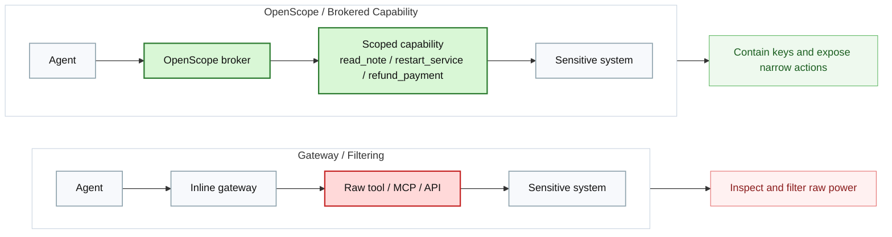
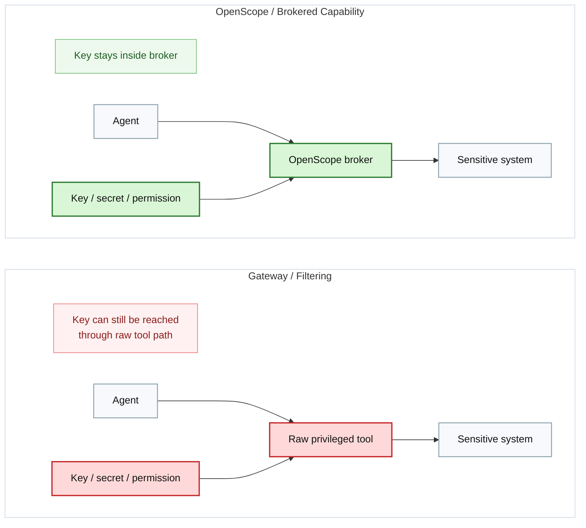

# Compare Page Brief

Design and generate the `Compare` page.

## Page Goal

Help technical buyers and builders understand where OpenScope fits relative to adjacent categories.

This page should clarify:

- what OpenScope is compared to AI gateways
- what it is compared to secret vaults
- what it is compared to MCP gateways and tool-curation layers
- when teams should use OpenScope alone vs together with another control layer

The tone should stay analytical and precise, not combative or hype-driven.

## Hero

### Headline

`Compare OpenScope`

### Subheadline

`OpenScope fits where raw privileged access must disappear from the agent path.`

### Intro Copy

`Many products improve AI governance, runtime control, or secret handling. OpenScope addresses a narrower and stricter problem: broker privileged actions so the agent uses approved capabilities without ever receiving the raw privileged primitive underneath.`

## Section: The Comparison Lens

### Headline

`Use the right question`

### Body

`Instead of asking whether a product can apply policy to tools, ask whether it leaves the raw privileged primitive exposed to the agent. That is the dividing line between broad governance and execution containment.`

Render this section as a bold framing block near the top.

## Section: Category Overview

Use four comparison cards.

### Card 1

Title:

`AI gateways`

Body:

`Best for routing, visibility, centralized policy, and traffic governance across many agents and tools. Their limitation is that they usually govern access to a path rather than removing the raw privileged path itself.`

### Card 2

Title:

`Secret vaults`

Body:

`Best for keeping credentials away from agents and users. Their limitation is that secret isolation alone does not define a full scoped action surface or execution model.`

### Card 3

Title:

`MCP gateways and tool-curation layers`

Body:

`Best for managing which tools are available and how they are exposed. Their limitation is that they are still often closer to gateway infrastructure than a strict brokered-capability model.`

### Card 4

Title:

`OpenScope`

Body:

`Best when the system owner wants the agent to use approved capabilities without ever possessing the raw path, key, permission, or broad interface underneath.`

Make the OpenScope card visually emphasized.

## Section: Architecture Difference

### Headline

`The difference is architectural, not just operational`

### Body

`A gateway inspects and filters a raw power path. OpenScope inserts a broker that contains keys and exposes a narrower action surface. This changes the trust model, not just the observability model.`

### Diagram

## Section: Comparison Table

Use a responsive comparison table on desktop and stacked cards on mobile.

### Columns

- `Product / category`
- `Best at`
- `Limitation vs OpenScope`

### Rows

- `Tailscale Apture | AI gateway, routing, logging, centralized policy | Governs traffic, but does not remove raw privileged paths`
- `BlueRock | Runtime security, sandboxing, guardrails | Strong runtime control, less focused on predefined scoped capabilities`
- `MintMCP | MCP gateway, role-based tool exposure | Curates MCP access, but is still closer to gateway infrastructure`
- `Peta / Agent Vault | Secret containment | Keeps keys away from agents, but does not fully define scoped action surfaces`
- `OpenScope | Privileged capability brokering | Best fit when agents should never hold the raw primitive`

Highlight the OpenScope row visually.

## Section: When to Use What

Use a three-column decision layout.

### Column 1

Title:

`Use a gateway when`

Bullets:

- `You need broad traffic-plane governance`
- `You need centralized model or tool routing`
- `You need visibility and review across many AI paths`

### Column 2

Title:

`Use OpenScope when`

Bullets:

- `You need execution-plane containment`
- `You do not want the agent to ever hold the raw primitive`
- `You need action-level and parameter-level policy`
- `You need tighter bypass resistance`

### Column 3

Title:

`Use both when`

Bullets:

- `You need broad governance and strong containment`
- `You want centralized traffic policy plus brokered privileged actions`
- `Different layers solve different trust problems`

## Section: Key Containment Difference

### Headline

`Keeping the key away is not the same as defining the action surface`

### Body

`Secret containment matters, but the stronger requirement in many workflows is that the agent should neither possess the key nor directly control a broad privileged interface. OpenScope combines containment with explicit capability design.`

### Diagram

## Final CTA

### Headline

`Use the right control layer for the right trust boundary`

### Body

`OpenScope is most valuable when the requirement is simple and strict: the agent should not receive the raw privileged primitive at all.`

### Buttons

- `Download OpenScope`
- `View Code`

