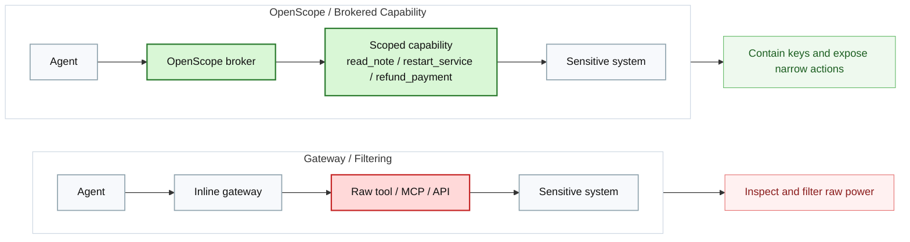
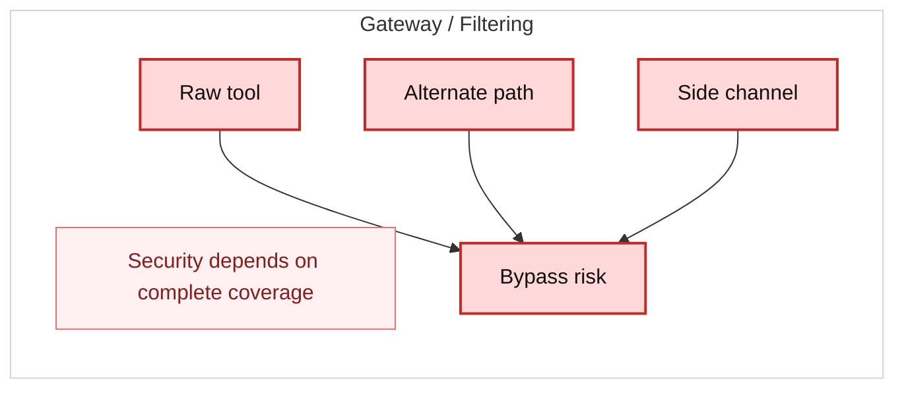
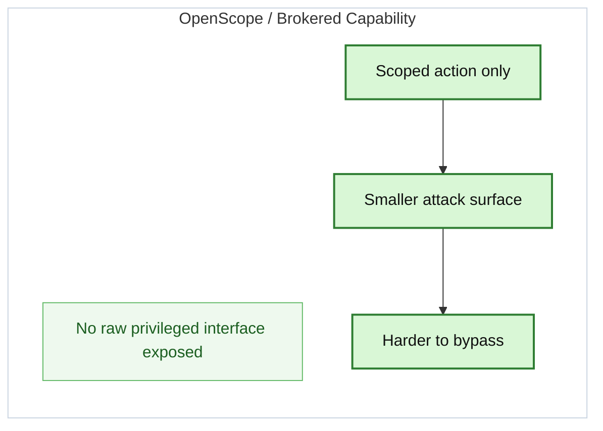
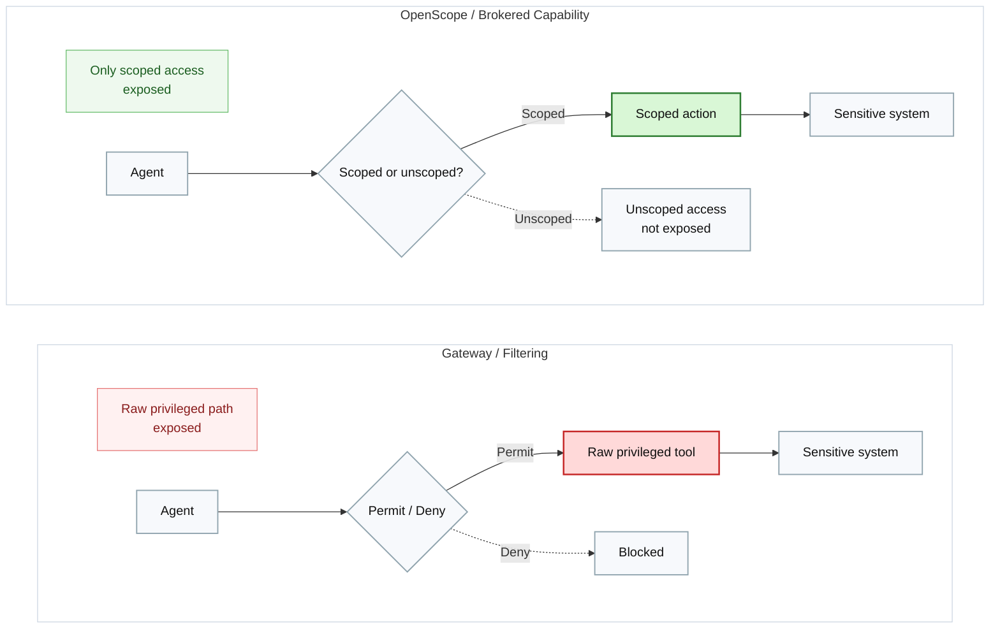
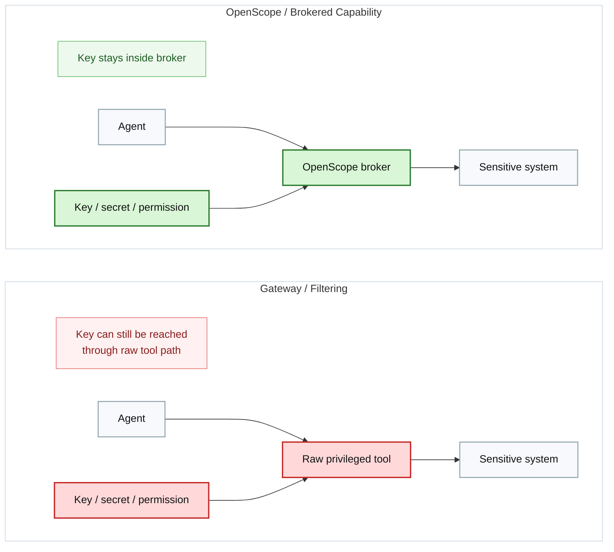

# OpenScope Homepage Brief

Design and generate the `open-scope.org` homepage.

## Page Goal

The homepage should make three things obvious in the first screen:

1. OpenScope is a capability broker for AI agents.
2. It is different from a gateway because it removes raw privileged paths.
3. Visitors can immediately view the code or download a release.

## Required Links

- Repo: `https://github.com/cylonix/openscope`
- Releases: `https://github.com/cylonix/openscope/releases`

## Hero

### Eyebrow

`Scoped, auditable agent access`

### Headline

`Don’t give AI agents raw power. Give them scoped capabilities.`

### Supporting Copy

`OpenScope is a capability broker that turns raw privileged access into narrow, policy-bound actions. Keep keys inside the broker. Remove raw interfaces from the agent path. Audit every decision.`

### Primary CTA

`Download OpenScope`

Links to:

`https://github.com/cylonix/openscope/releases`

### Secondary CTA

`View Code`

Links to:

`https://github.com/cylonix/openscope`

### Meta Strip

- `Open source`
- `Policy-bound actions`
- `Key containment by design`
- `Built for high-risk workflows`

### Hero Visual Requirement

Use a premium right-column panel that renders this Mermaid diagram or a polished visual based on it:



## Section: Why OpenScope

### Section Headline

`AI gateways help. High-risk workflows still need stronger containment.`

### Copy

`AI gateways improve governance, visibility, and routing. But when the raw privileged primitive still exists, adaptive agents can search for alternate paths. OpenScope is built for the stricter requirement: the agent should not receive the raw privileged path in the first place.`

### Supporting Points

- `Agents can change behavior without a normal redeploy`
- `Prompt and config changes can alter access patterns fast`
- `Adaptive agents search for alternate paths`
- `Coverage-dependent filtering is weaker when the actor is goal-seeking`

### Visual

Render or interpret this Mermaid:



## Section: The OpenScope Model

### Headline

`Contain keys. Remove raw powers. Expose only approved actions.`

### Copy

`OpenScope places a broker between the agent and the sensitive system. Instead of raw tools, the agent receives explicit actions such as reading a note, restarting a service, or refunding a payment. Policy is enforced at the action and parameter level.`

### Capability Example

```text
read_note(folder="Work")
restart_service(service="api")
refund_payment(charge_id="...")
```

### Visual



## Section: The Security Difference

Use a two-card layout.

### Card 1

Title:

`Execution containment`

Body:

`A gateway inspects access to a raw privileged path. A brokered-capability model removes that raw path from the agent entirely.`

Visual:



### Card 2

Title:

`Key containment`

Body:

`For high-risk systems, the stronger requirement is that the agent never possesses the key or broad permission at all. OpenScope keeps the key inside the broker.`

Visual:



## Section: Use Cases

### Headline

`Where capability brokering becomes necessary`

### Supporting Line

`Best fit when the system owner does not want the agent to ever hold the raw primitive.`

### Cards

- `Production operations`
- `SSH-based remediation`
- `Sensitive databases`
- `Internal admin APIs`
- `Endpoint automation`
- `Finance and support actions`
- `OpenClaw on macOS`
- `Sandboxed NemoClaw`
- `Brokered Jira and SSH extensions`

## Section: Compare

Use a responsive comparison table.

### Columns

- `Product`
- `Best at`
- `Limitation vs OpenScope`

### Rows

- `Tailscale Apture | AI gateway, routing, logging, centralized policy | Governs traffic, but does not remove raw privileged paths`
- `BlueRock | Runtime security, sandboxing, guardrails | Strong runtime control, less focused on predefined scoped capabilities`
- `MintMCP | MCP gateway, role-based tool exposure | Curates MCP access, but is still closer to gateway infrastructure`
- `Peta / Agent Vault | Secret containment | Keeps keys away from agents, but does not fully define scoped action surfaces`
- `OpenScope | Privileged capability brokering | Best fit when agents should never hold the raw primitive`

Highlight the OpenScope row.

## Section: Developer Action

Create three cards.

### Card 1

Title:

`Read the source`

Body:

`Inspect the broker model, policy system, daemon, and integrations directly on GitHub.`

CTA:

`View repository`

### Card 2

Title:

`Download OpenScope`

Body:

`Get the latest release packages and installation assets from GitHub Releases.`

CTA:

`Download latest release`

### Card 3

Title:

`Quick start`

Code:

```bash
openscope status
openscope notes list_notes --agent openclaw --folder Work
openscope notes read_note --agent openclaw --folder Work --note "My Note"
```

Caption:

`OpenScope brokers protected actions through a daemon instead of handing raw privileged access to the agent.`

## Final CTA

### Headline

`Don’t just watch privileged paths. Replace them with scoped capabilities.`

### Body

`Use gateways for broad governance. Use OpenScope where bypass resistance and key containment matter.`

### Buttons

- `Download OpenScope`
- `View Code on GitHub`

### Closing Question

`Do you leave the raw privileged primitive exposed to the agent?`

