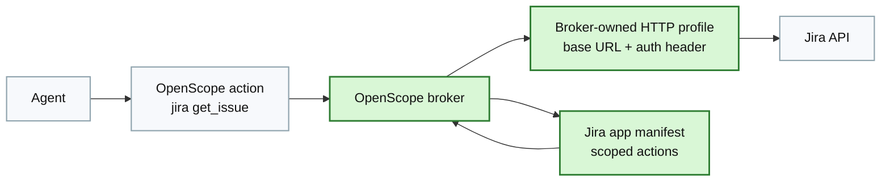

# How It Works Page Brief

Design and generate the `How It Works` page.

## Page Goal

Explain the OpenScope architecture clearly enough that a technical buyer or developer understands the broker model, policy model, and extension model.

## Hero

### Headline

`How OpenScope Works`

### Subheadline

`A thin client sends scoped requests to a broker daemon that holds privileged execution boundaries, enforces policy, and records decisions.`

## Section: Architecture Overview

### Intro Copy

`OpenScope separates the agent-facing interface from the privileged execution layer. The agent calls a small client surface. The broker daemon validates the request, applies policy, performs the approved action through a protected executor, and records the result.`

### Architecture Diagram

```mermaid
flowchart LR
    A["AI agent"] --> B["openscope CLI<br/>thin client"]
    B --> C["openscoped daemon<br/>broker"]
    C --> D["Protected executor"]
    D --> E["Sensitive system"]

    F["Policy rules"] --> C
    G["Audit log"] <-- C
    H["Broker-owned credentials / permissions"] --> C

    classDef broker fill:#d9f7d6,stroke:#2e7d32,stroke-width:2px,color:#111;
    classDef neutral fill:#f7f9fc,stroke:#90a4ae,stroke-width:1.5px,color:#111;
    classDef side fill:#eef6ff,stroke:#7aa7d9,stroke-width:1.5px,color:#123;

    class C broker
    class A,B,D,E neutral
    class F,G,H side
```

## Section: Request Lifecycle

Render this as a numbered process with strong visuals.

### Step 1

`The agent asks for a scoped action`

Body:

`The agent calls a predefined action such as reading a note, listing messages, querying Jira, or checking a service.`

### Step 2

`The broker validates and authorizes`

Body:

`OpenScope checks which agent is calling, which app and action are requested, and whether the parameters match an allow rule.`

### Step 3

`The privileged operation stays inside the broker`

Body:

`The broker holds the actual automation approval, credential, profile, or target configuration. The agent does not receive that primitive directly.`

### Step 4

`The broker records the decision`

Body:

`Allow and deny decisions are auditable. OpenScope appends the outcome to an audit log so actions are visible after the fact.`

## Section: Scoped Capabilities, Not Raw Tools

### Headline

`OpenScope exposes actions with policy-shaped parameters`

### Copy

`A capability is narrower than a raw tool surface. Instead of generic shell access or raw automation access, the broker exposes named actions whose parameters can participate in policy.`

### Example

```text
openscope notes list_notes --agent openclaw --folder Work
openscope notes read_note --agent openclaw --folder Work --note "Sprint Plan"
openscope mail list_messages --agent openclaw --mailbox Inbox --limit 20 --unread true
```

### Policy Example

```text
sudo openscope policy allow --agent my-agent --app notes --action list_notes --folder Work
sudo openscope policy allow --agent my-agent --app notes --action read_note --folder Work
sudo openscope policy deny  --agent my-agent --app notes --action list_notes --folder Private
```

## Section: Integrations

Use four cards or panels.

### Notes and Mail

`OpenScope already brokers protected access to Apple Notes and Apple Mail with scoped actions and policy checks.`

### HTTP Profiles

`For brokered HTTP integrations such as Jira, OpenScope can keep root-owned HTTP profiles in the broker while exposing narrow read-only or write actions to the agent.`

### SSH Targets

`For scoped SSH operations, named targets and approved services live in broker-owned configuration so the agent does not improvise with broad shell access.`

### Custom Apps

`New integrations can be declared in YAML, including actions, parameters, outputs, and executor behavior, without changing the core trust model.`

## Section: Jira Example

### Headline

`Broker external APIs without handing the token to the agent`

### Body

`A Jira integration can be split into a broker-owned HTTP profile and a user-defined app manifest. The broker keeps the base URL and authorization header. The manifest defines narrow actions such as get issue, search issues, or list comments.`

### Mermaid



## Section: Packaging and Runtime Shape

### Copy

`On macOS, OpenScope is designed to package a signed runtime so stable Automation approval attaches to the broker, not to the agent. The CLI stays lightweight while the privileged daemon remains the narrow execution boundary.`

### Supporting Points

- `Signed app bundle for stable identity`
- `LaunchAgent-managed daemon`
- `CLI wrapper installed on PATH`
- `Protected resources bundled with the broker runtime`

## Final CTA

- `Download OpenScope`
- `View Code`

