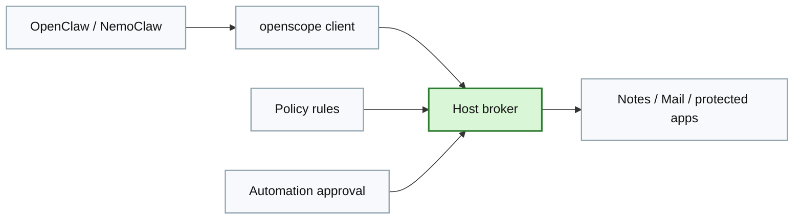
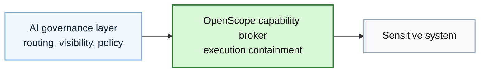

# Use Cases Page Brief

Design and generate the `Use Cases` page.

## Page Goal

Show where OpenScope is the right fit and why capability brokering matters across enterprise, local, and extension-driven workflows.

## Hero

### Headline

`Where OpenScope Fits`

### Subheadline

`Use OpenScope when the system owner does not want the agent to ever hold the raw primitive.`

## Section: Enterprise Agent Workflows

### Intro Copy

`In enterprise environments, the biggest question is often not whether an agent can be governed. It is whether the agent ever receives the dangerous primitive at all. OpenScope is strongest where privileged actions must stay tightly bounded.`

### Use Case Cards

- `Production operations`
  Body: `Restart services, inspect approved logs, or run narrow remediation actions without exposing general-purpose shell or infrastructure paths.`
- `Internal admin APIs`
  Body: `Broker access to sensitive admin endpoints through predefined actions instead of broad API credentials.`
- `Sensitive databases`
  Body: `Expose approved reads or carefully constrained operations without handing over raw database connectivity.`
- `Finance and support actions`
  Body: `Broker actions like refunds, account adjustments, or support lookups through explicit, reviewable operations.`

## Section: Local and Personal Workflows

### Intro Copy

`OpenScope also fits local and personal workflows where the concern is broad host power. Instead of giving an agent raw Apple automation or shell-level access, OpenScope keeps those permissions in a broker on the host.`

### Use Case Cards

- `OpenClaw on macOS`
  Body: `Use brokered Notes and Mail actions instead of handing the agent raw automation access.`
- `Sandboxed NemoClaw`
  Body: `Keep the broker on the host while a sandboxed client calls through a socket or HTTP bridge.`
- `Protected Notes and Mail access`
  Body: `Constrain folders, mailboxes, and action surfaces so the agent gets a narrower, safer interface.`

### Personal Workflow Diagram

## Section: Brokered Extensions

### Intro Copy

`OpenScope is not limited to built-in local actions. The same broker model can be extended to HTTP and SSH-backed operations while preserving the core trust boundary.`

### Use Case Cards

- `Jira over broker-owned HTTP profiles`
  Body: `Keep the Jira token in the broker and expose narrow actions such as get issue or search issues.`
- `Scoped SSH service operations`
  Body: `Name specific targets and allowed services so the agent can request service status or bounded operations without broad shell access.`
- `Custom app manifests`
  Body: `Define new app actions in YAML while preserving action-level policy and audit behavior.`

## Section: Choosing the Right Control Layer

### Headline

`Use gateways for broad governance. Use OpenScope where bypass resistance and key containment matter.`

### Comparison Copy

`OpenScope is not a substitute for every governance tool. It is the layer for workflows where raw privileged access should disappear from the agent path. Many teams will use both: a gateway for traffic-plane governance and OpenScope for execution-plane containment.`

### Diagram

## Final CTA

- `Download OpenScope`
- `View Code`

