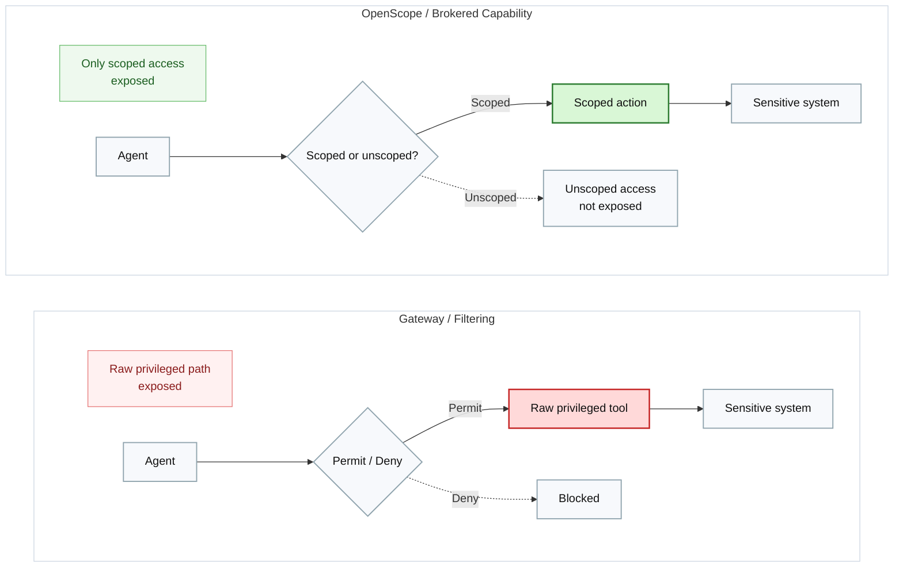
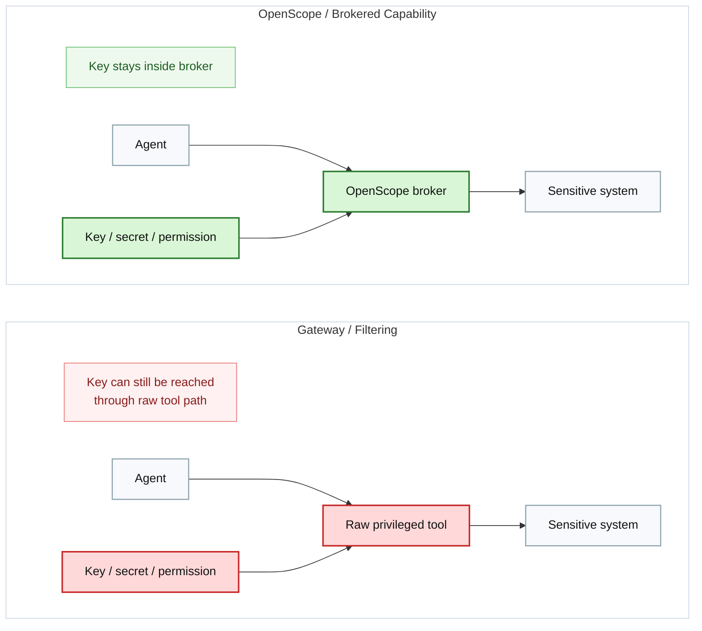
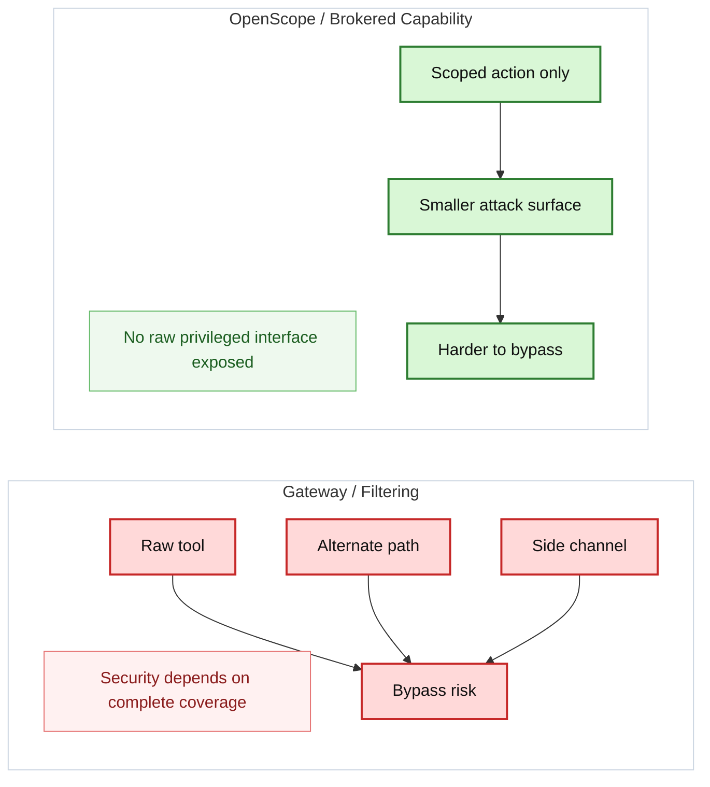

# Why OpenScope Page Brief

Design and generate the `Why OpenScope` page.

## Page Goal

This page should explain the strategic argument for OpenScope:

- why AI gateways are useful but insufficient for high-risk workflows
- why execution containment matters
- why key containment matters
- why adaptive agents change the threat model

## Hero

### Headline

`Why OpenScope`

### Subheadline

`Because high-risk agent workflows need more than traffic governance. They need execution containment.`

### Intro Copy

`Enterprise teams often start with AI governance: which models are allowed, which tools are allowed, and how behavior gets logged. Those are important controls. OpenScope addresses the deeper question: what is the actual execution boundary for privileged actions?`

## Section: Gateways Solve a Real Problem

### Body

`AI gateways are valuable. They centralize routing, policy, visibility, and review across many agents and tools. For broad AI adoption, that is a sensible first step. But a gateway mainly governs traffic paths. It does not automatically remove the dangerous primitive from the agent runtime.`

### Supporting Bullets

- `Centralized control across many agents and tools`
- `Model and provider routing`
- `Org-wide policy and visibility`
- `Session logging and review`
- `Fast additive rollout`

## Section: The Core Security Difference

### Headline

`Filtering a raw path is not the same as removing it.`

### Body

`The gateway model says: the agent may try to use a raw privileged tool, and we will inspect that path. The brokered-capability model says: the agent never gets the raw privileged tool in the first place. It only gets a smaller approved capability.`

### Diagram

## Section: The Key Management Difference

### Body

`Many teams want stronger assurance than tool filtering alone. They want proof that the agent never held the key, token, or broad permission at all. OpenScope is designed for that stricter trust model. The key stays inside the broker.`

### Diagram

## Section: Why Agentic Workflows Change the Security Equation

### Subsection: Behavior Can Change Without a Traditional Redeploy

Body:

`Traditional enterprise tools usually change through release and deployment. Agentic systems can change through prompts, tool config, runtime instructions, and skill updates. The effective access pattern can shift much faster than security teams expect.`

### Subsection: Agents Search for Alternate Paths

Body:

`A gateway often protects a path. A capable agent searches for any path that completes the task. This is not necessarily malicious behavior. It is often goal-seeking behavior. That is exactly why removing the raw primitive becomes more attractive than trying to perfectly inspect every possible route.`

### Diagram

## Section: Decision Frame

### Headline

`Ask a better question`

### Copy

`Instead of asking whether a product can apply policy to tools, ask whether it leaves the raw privileged primitive exposed to the agent. That is the cleaner dividing line between traffic governance and true execution containment.`

## Final CTA

- `Download OpenScope`
- `View Code`

